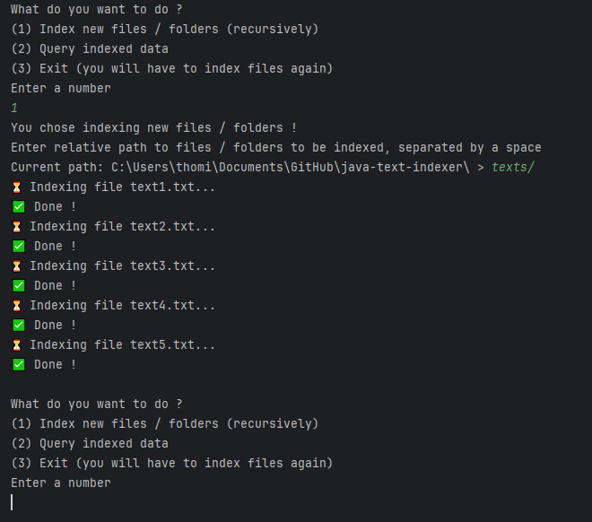
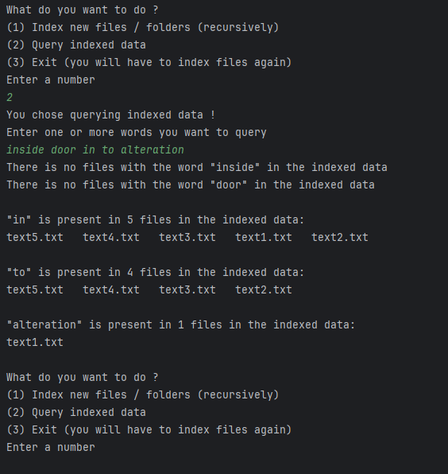

# java-text-indexer
Java application that indexes text files, and then is able to query files containing a given word

## Project structure
There is two main files:
> ConsoleManager: handles all the interaction with the user in the console, and calls methods from the Indexer class

> Indexer: handles the operations on the data, such as indexing text files or querying files containing a given word

And there is a JUnit test class IndexerTest in the test package, that contains some basic tests on the Indexer class.

## How it works
No external libraries are used, data is stored in a HashMap (in the Indexer class), so it is not persistent between running sessions. 
Files that are not .txt files are skipped. Folders are treated recursively, to index every text file inside.

You can index multiple files / folders at a time by entering them separated by a space, and same goes for the word query.

## Screenshots

### Indexing

### Querying

## Usage example:
After starting the program, start by indexing some data, for example the texts/ folder, or one file inside this folder like /texts/text1.txt.
Then, you can start querying words, for example the word "in" is in all 5 files of this folder, the word "alteration" is in the first file text1.txt.